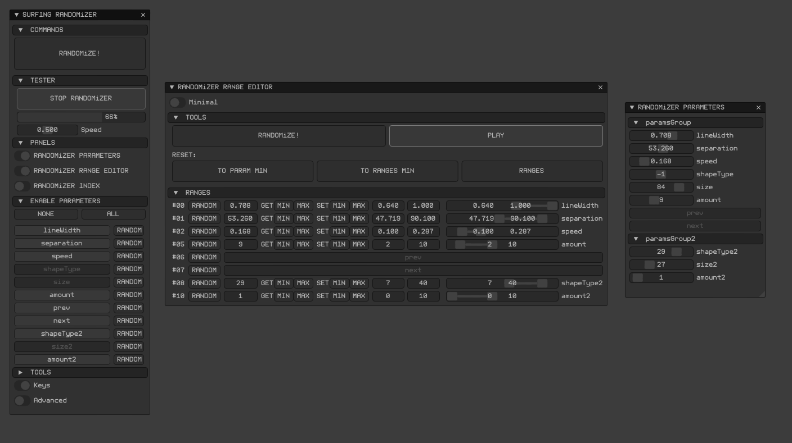

# ofxSurfingRandomizer

## Overview
An **openFrameworks** add-on to perform a ranged randomization between the minimun and maximum values of selected ```ofParameters``` on a group.

## Screencast 
<!--  -->



## Features
- Just pass your ```ofParameterGroup``` parameters container.
- Only ```float```, ```int``` and ´´´bool´´´ types yet.
- Auto Store/Recall all the settings.
- Reset, Store/Recall memory states and other helpers.
- **ImGui** based GUI ready to integrate.

## Usage
 
**ofApp.h**
```.cpp
#include "ofxSurfingRandomizer.h"

ofxSurfingRandomizer data;

ofParameterGroup params; // main container
ofParameter<float> lineWidth;
ofParameter<float> separation;
ofParameter<float> speed;
ofParameter<int> amount;
ofParameter<int> shapeType;
```

**ofApp.cpp**
```.cpp
void ofApp::setup() 
{
	params.setName("paramsGroup");
	params.add(lineWidth.set("lineWidth", 0.5, 0.0, 1.0));
	params.add(separation.set("separation", 50.0, 1.0, 100.0));
	params.add(speed.set("speed", 0.5, 0.0, 1.0));
	params.add(amount.set("amount", 1, 1, 10));
	params.add(speed.set("shapeType", 0, 0, 3));

	data.setup(params);
}

void ofApp::draw() {

	data.draw();
}

void ofApp::keyPressed(int key) {

	if (key == ' ')
	{
		data.doRandomize();
	}
	if (key == OF_KEY_RETURN)
	{
		data.doResetParams();
	}
}
```

<details>
  <summary>Dependencies</summary>
  <p>

Clone these add-ons and include into the **OF PROJECT GENERATOR** to allow compile your projects or the examples:
* [ofxImGui](https://github.com/Daandelange/ofxImGui/tree/ofParameters-Helpers-Test)  [FORK|BRANCH]  
* [ofxSurfingHelpers](https://github.com/moebiussurfing/ofxSurfingHelpers)  
* [ofxWindowApp](https://github.com/moebiussurfing/ofxWindowApp)  [Only for **example-Basic**]  

*Thanks a lot to all these ofxAddons coders.*  
  </p>
</details>

<details>
  <summary>Tested Systems</summary>
  <p>

  - **Windows 10** / **VS 2017** / **OF ~0.11**
  </p>
</details>

## TODO
* Add more types: 2D/3D vectors and colors. Using templates [?] ...
[ ANY HELP/PULL ON THIS IS REALLY APPRECIATED! ]
* Undo engine

## Author
An add-on by **@moebiusSurfing**  
*( ManuMolina ) 2021*  

[Twitter](https://twitter.com/moebiussurfing/)  
[YouTube](https://www.youtube.com/channel/UCzUw96_wjmNxyIoFXf84hQg)  
[Instagram](https://www.instagram.com/moebiussurfing/)  
